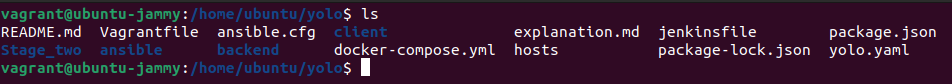

# YOLO Project Setup - Stage 1

This README outlines the setup and provisioning of the YOLO project using Ansible and Vagrant.

## Table of Contents
- [Project Overview](#project-overview)
- [Requirements](#requirements)
- [Installation](#installation)
- [Usage](#usage)

## Project Overview

The YOLO Project is a full-stack application designed for managing products seamlessly. 

## Requirements

Before you begin, ensure you have met the following requirements:

- [Vagrant](https://www.vagrantup.com/downloads) installed on your machine.
- [VirtualBox](https://www.virtualbox.org/) installed.
- [Ansible &  Terraform](https://www.ansible.com/) installed on your host machine.

## Installation

1. **Clone the repository:**

   ```bash
   git clone https://github.com/GacheruIan/yolo.git
   cd yolo

2. **Provision the Vagrant box:**
   vagrant up
   

3. **SSH into the Vagrant box:**
   vagrant ssh
   cd /home/ubuntu/yolo
   docker ps-a to confirm images are well config
   docker-compose up
   

**some config in stage1 had to be commented out in stage2 you can use commit logs to check first yaml or switch to stage1 branch**


   
