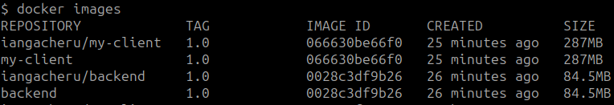

# YOLOMY

## 1. Choice of Base Image
The base image used for both the frontend (`my-client`) and backend (`backend`) services is **Node.js 16-alpine3.16**. This Alpine version is selected for its lightweight nature, security features, and suitability for production environments. Using Alpine images helps reduce the container size, which is essential for faster builds and deployments.

## 2. Dockerfile Directives

### Frontend (Client):
**Build Stage:**
- **WORKDIR /client:** Sets the working directory.
- **COPY package*.json ./:** Copies necessary package files.
- **RUN npm install:** Installs dependencies.
- **COPY . .:** Copies the entire project.
- **RUN npm run build:** Builds the React app for production.

**Production Stage:**
- **COPY --from=build:** Copies built static files from the build stage.
- **RUN npm install --only=production:** Installs only production dependencies.
- **CMD ["npm", "start"]**: Starts the application.

### Backend:
**Build Stage:**
- **WORKDIR /backend:** Sets the working directory.
- **COPY package*.json ./:** Copies necessary package files.
- **RUN npm install:** Installs both dev and production dependencies.
- **COPY . .:** Copies the entire project.

**Production Stage:**
- **COPY --from=build:** Copies backend production files from the build stage.
- **RUN npm prune --production:** Prunes unnecessary development dependencies.
- **CMD ["npm", "start"]**: Starts the backend service.

**MongoDB:** The MongoDB service uses the `mongo:4.4.18-focal` image, a lightweight version based on Ubuntu's focal release.

## 3. Docker-compose Networking
- **Ports:**
  - Frontend (`my-client`) is mapped to `localhost:3000`.
  - Backend (`backend`) is mapped to `localhost:5000`.
  - MongoDB (`mongo`) is mapped to `localhost:27017`.
  
- **Bridge Network (inet):** All services are connected through a custom bridge network (`inet`), allowing inter-service communication by container names, such as `mongo`, `backend`, and `my-client`.

## 4. Docker-compose Volume Definition
### MongoDB Data Persistence:
The volume **mongo-data** is defined and mounted to `/data/db` in the MongoDB service. This setup ensures that MongoDB data persists even if the container is stopped or removed.

## 5. Git Workflow
### Branches:
- **Master branch:** For production-ready code.
- **gh-workshop:** Used For feature developmen

### Commit Messages:
Use meaningful commit messages used.

### Pull Requests:
Ensure code reviews are conducted before merging into the master branch to maintain code quality.

## 6.0 Successful running of the applications 
Up and running with persistency.

## 6.1 Debugging Measures
### Healthchecks:
Both frontend and backend services include health checks to monitor the health of the services:
- **Frontend:** Checks the availability of `http://localhost:3000`.
- **Backend:** Checks the backend's health endpoint at `http://localhost:5000/health`.

### Container Logs:
Use `docker-compose logs -f <service>` to tail logs for each service and identify any runtime errors.

### Build Failures:
Multi-stage builds are utilized to separate dependencies for different environments and reduce the complexity of the final image.

## 7. Docker Image Tag Naming Standards

## 8. Deployed Image on DockerHub

