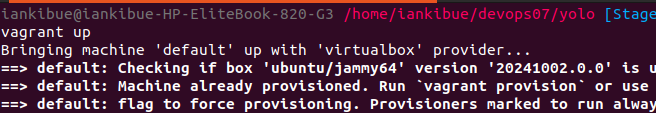
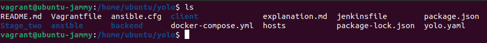

# YOLO Project Setup - Stage 1

This README outlines the setup and provisioning of the YOLO project using Ansible and Vagrant.

## Table of Contents
- [Project Overview](#project-overview)
- [Requirements](#requirements)
- [Installation](#installation)
- [Usage](#usage)

## Project Overview

The YOLO Project is a full-stack application designed for managing products seamlessly. 

## Requirements

Before you begin, ensure you have met the following requirements:

- [Vagrant](https://www.vagrantup.com/downloads) installed on your machine.
- [VirtualBox](https://www.virtualbox.org/) installed.
- [Ansible &  Terraform](https://www.ansible.com/) installed on your host machine.

## Installation

1. **Clone the repository:**

   ```bash
   git clone https://github.com/GacheruIan/yolo.git
   cd yolo

2. **Provision the Vagrant box:**
   vagrant up
   

3. **SSH into the Vagrant box:**
   vagrant ssh
   cd /home/ubuntu/yolo
   docker ps-a to confirm images are well config
   docker-compose up
   

   **use yaml in stage1 to achieve the above accurately, the new yaml some things are different for stage2 objectives**


   # Stage 2: Ansible and Terraform - Automated Infrastructure and Application Provisioning

   extending our environment to incorporate both Terraform for infrastructure provisioning and Ansible for configuration management and application deployment. This setup enables a fully automated workflow, allowing us to provision and configure a server with a single command.

   ## Installation

1. **Provision Infrastructure with Terraform:**

   Navigate to the Terraform directory:


   **Initialize Terraform: Downloads required provider plugins.**

   terraform init

   <br />


2. **Apply Terraform Configuration: Creates a Docker container based on Ubuntu.**

   terraform apply     
   confirm by saying yes


   <br />


3. **Configure and Deploy Application with Ansible**

   Add Your Docker container’s IP (e.g., 172.17.0.2), to the Ansible hosts inventory file.

   <i><b>Currently the existing one is my IP for my running docker image.</i></b>

   You can check your ip by running:-

   **docker inspect <container_name_or_id> | grep "IPAddress"**


   <br />

4. **Run Ansible Playbook:**

   Deploys and configures the application on the provisioned Docker container.

   **ansible-playbook ansible/yolo.yaml** 
   
   you can add --ask-become-pass if facing sudo err. 


   <br />

    **Visit http://172.17.0.2:3000 in your browser to verify deployment or the ip you specified**


   